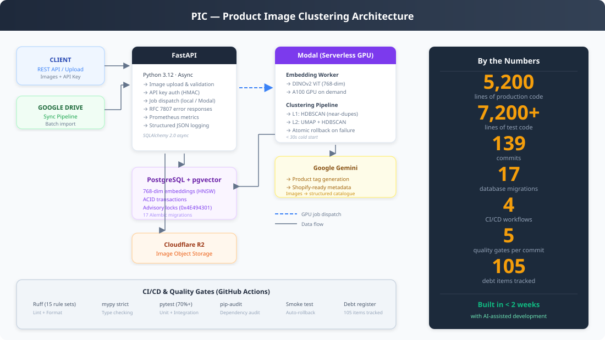

# Architecture Overview

PIC (Product Image Clustering) consists of four main components that can be deployed on any infrastructure.



## Components

```
                    ┌─────────────────┐
                    │   API Server    │
                    │   (FastAPI)     │
                    └────┬───────┬────┘
                         │       │
              dispatch   │       │  read/write
              jobs       │       │
                         ▼       ▼
                ┌──────────┐  ┌──────────────────┐
                │  Worker  │  │   PostgreSQL      │
                │ (local/  │  │   + pgvector      │
                │  Modal)  │  │                   │
                └────┬─────┘  └──────────────────┘
                     │
              read/write images
                     │
                     ▼
                ┌──────────────────┐
                │  Object Storage  │
                │  (S3-compatible) │
                └──────────────────┘
```

### API Server (FastAPI)

The REST API handles all client requests: image management, clustering triggers, search, and pipeline orchestration.

- **Runtime**: Python 3.12, async (uvicorn)
- **Resources**: 512MB-1GB RAM, 1 vCPU minimum
- **Network**: Needs access to PostgreSQL, object storage, and worker dispatch
- **Stateless**: Can be scaled horizontally

### Workers

ML workloads run outside the API: DINOv2 embedding generation, HDBSCAN clustering, URL ingest and Google Drive sync. `PIC_WORKER_BACKEND` picks where:

| Backend | How jobs reach it | Guide |
|---|---|---|
| `local` (default) | The API leaves the job PENDING in Postgres; `pic-worker` claims it with `FOR UPDATE SKIP LOCKED` and runs it | [self-hosted.md](self-hosted.md) |
| `modal` | The API spawns the matching Modal function | [modal-setup.md](modal-setup.md) |

Both backends call the same job code in `src/pic/worker/`. Job input is stored on the job row (`jobs.params`).

- **Runtime**: Python 3.12 with PyTorch, torchvision, scikit-learn, umap-learn
- **Resources**: 8GB+ RAM (16GB for 10k+ images). A GPU speeds up embeddings: CUDA on Modal, Apple MPS when `pic-worker` runs natively on macOS. The Linux Docker image is CPU-only.

### PostgreSQL + pgvector

Stores image metadata, cluster assignments, job state, and 768-dimensional DINOv2 embeddings with HNSW index for fast similarity search.

- **Version**: PostgreSQL 16+ with pgvector (compose and CI use `pgvector/pgvector:pg18`). The initial migration creates the `vector` extension
- **Resources**: 1GB+ RAM (scales with dataset size)
- **Key indexes**: HNSW on embedding column, composite indexes on frequently queried columns

### Object Storage (Pluggable Backend)

Stores image files via a pluggable `StorageBackend` protocol. Three implementations are provided:

| Backend | Config Value | Use Case |
|---------|-------------|----------|
| **S3** (default) | `PIC_STORAGE_BACKEND=s3` | Production (Cloudflare R2, MinIO, AWS S3) |
| **GCS** | `PIC_STORAGE_BACKEND=gcs` | Google Cloud deployments |
| **Local** | `PIC_STORAGE_BACKEND=local` | Development & testing (serves files at `/files`) |

- **Prefixes**: `images/`, `processed/`, and `rejected/`
- **Lifecycle**: Images move from `images/` to `processed/` after ingestion, or `rejected/` if duplicate
- **Local backend**: Not allowed in production environments (validated at startup)

## Reference Deployments

### Local Development

```bash
mkdir -p data/images
docker compose up --build -d     # db + api (migrates on start) + pic-worker
```

For API development, run `docker compose up db -d` and `uv run fastapi dev src/pic/main.py`, plus `uv run pic-worker` to process jobs.

### Cloud (container host + Modal)

| Component | Platform | Notes |
|-----------|----------|-------|
| API Server | Any container host | `Dockerfile` default (`api`) stage |
| Workers | Modal (`PIC_WORKER_BACKEND=modal`) | Serverless, pay-per-use GPU |
| Database | Neon / Supabase | Managed PostgreSQL with pgvector |
| Object Storage | Cloudflare R2 | S3-compatible, free egress |

### Self-Hosted

Any combination of:
- API: Docker container or direct `uvicorn` process
- Workers: one `pic-worker` process (Docker `worker` target, or `uv run pic-worker`)
- Database: Any PostgreSQL 16+ with pgvector
- Storage: local filesystem, any S3-compatible store (MinIO, AWS S3, R2), or Google Cloud Storage

## Environment Variables

All configuration is via environment variables with the `PIC_` prefix.

| Variable | Required | Description |
|----------|----------|-------------|
| `PIC_DATABASE_URL` | Yes | PostgreSQL connection string (asyncpg) |
| `PIC_API_KEY` | Production | API authentication key |
| `PIC_AUTH_DISABLED` | No | Explicit opt-out for unauthenticated mode |
| `PIC_STORAGE_BACKEND` | No | Storage backend: `s3` (default), `gcs`, `local` |
| `PIC_WORKER_BACKEND` | No | Where jobs run: `local` (default, `pic-worker`) or `modal` |
| `PIC_S3_ENDPOINT_URL` | S3 only | S3-compatible endpoint |
| `PIC_S3_ACCESS_KEY_ID` | S3 only | S3 access key |
| `PIC_S3_SECRET_ACCESS_KEY` | S3 only | S3 secret key |
| `PIC_S3_BUCKET` | S3 only | Bucket name (default: `pic-images`) |
| `PIC_GCS_BUCKET` | GCS only | GCS bucket name |
| `PIC_GCS_PROJECT_ID` | GCS only | GCS project ID |
| `PIC_GCS_CREDENTIALS_JSON` | GCS only | Service account JSON |
| `PIC_LOCAL_STORAGE_PATH` | Local only | Filesystem path (default: `data/storage`) |
| `PIC_LOCAL_STORAGE_BASE_URL` | Local only | Base URL for file serving |
| `PIC_CORS_ORIGINS` | No | Allowed CORS origins (comma-separated) |
| `PIC_LOG_LEVEL` | No | Log level (default: `INFO`) |
| `PIC_GDRIVE_FOLDER_ID` | No | Google Drive folder for sync |
| `PIC_GDRIVE_SERVICE_ACCOUNT_JSON` | No | GDrive service account credentials |
| `PIC_GDRIVE_SCOPES` | No | OAuth scopes for Google Drive sync |

See `.env.example` for a complete reference.
